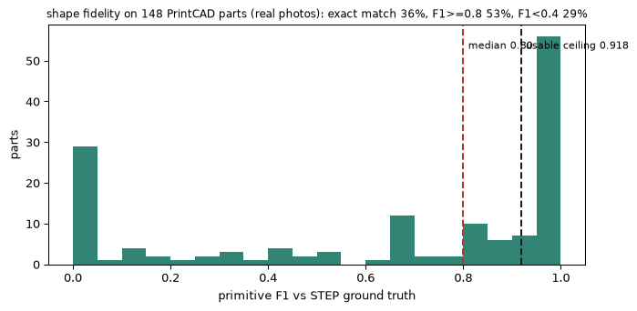
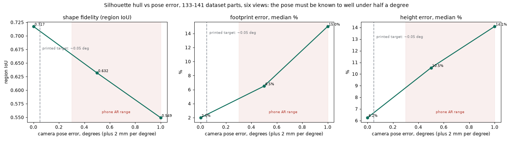
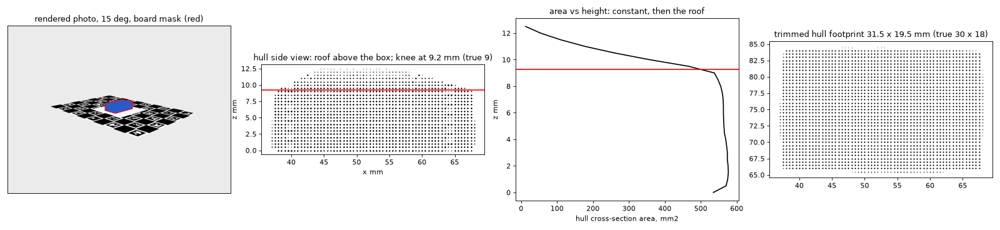
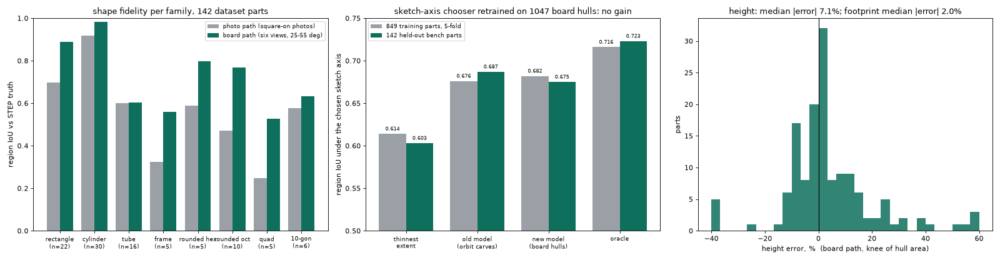
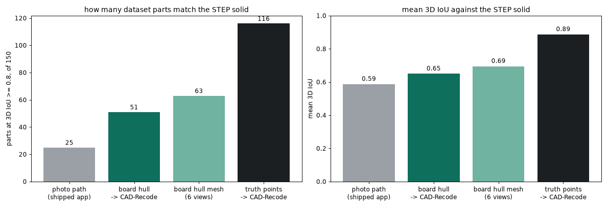
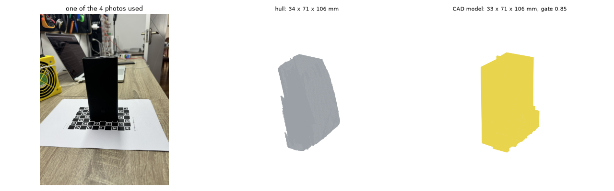

# photo2fcstd

Photos or a short video of a part go in; an editable, parametric FreeCAD model comes out.
That was the goal. This repository is the record of one week spent finding out how much of it is
reachable, measured against 1,900 real parts with STEP ground truth, and the code that survived.

The short version: **the geometry has to be captured, not inferred.** Given the true geometry of a
part, an off-the-shelf model writes matching CAD for 116 of 150 parts. Given three casual phone
photos, the best pipeline built here matches 25. Given six photos on a printed calibration sheet,
51 to 58, and the gap is concave features that no silhouette can see. Five different ways of
recovering the camera pose from the photos alone were measured and all five came out at zero.

Everything below is in `docs/architecture_v2.md` with the exact numbers, commands and commit
hashes. `runs/` holds the benchmark outputs. Nothing here was hand-picked: every number is the
mean over the same 150-part bench, paired.

## What is in the repo

| piece | where | state |
|---|---|---|
| photo path: recognise, trace, template, verify gate | `src/photo2fcstd/design.py`, `recognise.py`, `trace.py` | shipped; 46% of parts with the right sketch, 17% with the right solid |
| printed-sheet path: pose, masks, visual hull, CAD-Recode fit | `capture.py`, `carve.py`, `design.py` board tier, `tools/cadrecode_run.py` | shipped; needs the sheet from `make_target.py` |
| solid bench: shipped app vs STEP truth in 3D | `tools/solid_bench.py`, `tools/solid_report.py` | the headline metric |
| board bench on rendered dataset parts | `tools/board_bench.py`, `tools/cadrecode_bench.py`, `tools/chain_bench.py` | how the sheet path is validated without printing |
| regression tests | `tests/test_regression_*.py`, `tests/test_board_path.py` | lock round-part sketches, the fan build, eleven solids in 3D, and the sheet path |
| rented-GPU guardrails | `tools/vast_run.sh`, `tools/vast_watchdog.sh` | every remote job has a timeout, a heartbeat and a watchdog that destroys idle or stalled boxes |

## The journey, in order

### 1. A template fitter with an honesty gate
The general "compile any photo into CAD" path always returned a valid but wrong solid. It was
replaced by recognition (an LLM names the class), measurement, templates for the classes that have
one, and a gate that refuses instead of emitting a wrong model. On the dataset the gate refuses 6%
and is right to.

### 2. What three photos can and cannot tell you
Shape fidelity of the photo path on 148 parts: a third exact, half at F1 ≥ 0.8, a pile at zero
made of cylinders photographed on their side.



### 3. Pose from pixels, five times, five zeros
Every attempt to recover where the camera was from the photos themselves:

| method | result on the paired bench |
|---|---|
| VGGT face pose, rectify the tilted face | +0.03 region IoU with an agreement picker, 31 wins / 29 losses without it |
| joint silhouette fit of a prism to three views | 0.581 → 0.519 on the parts it fired on; matches silhouettes, wrong face |
| vanishing points of the part's own edges | 8 wins / 9 losses, net zero |
| phone-grade poses (0.5°, 1°) into the hull | 0.717 → 0.632 → 0.549 |
| refinement on top of phone-grade poses | did not recover the box |



### 4. Round parts: the recogniser was the bug
Cylinders scored F1 0.50 on the bench. With one consistent recognition run the same geometry
scores 0.93: the LLM had been flipping its "revolve" flag between runs. Tubes got a bore measured
from the end view, and recognition now names the family (rod, disc, tube, washer, cup, cap) to
settle the one ambiguity silhouettes cannot. Rounds: F1 0.50 → 0.89, tubes 0.69 → 0.90.

### 5. The solid bench: sketches lie
Comparing the built FreeCAD solid with the STEP mesh instead of comparing sketches: 15% of parts
match at 3D IoU ≥ 0.8 where sketch scores had suggested 46%. The third dimension was hiding behind
them. Revolve length from the side view instead of the face view, and the disc-versus-rod call,
took revolves from 0.58 to 0.66 in 3D. The silhouette gate turned out to be uncorrelated with 3D
correctness: it can judge an outline, never a depth.


### 6. Reconstruct perspective first: the printed sheet
A ChArUco sheet under the part gives every photo an exact pose and millimetre scale. The v1 code
for it had never met a real photo; its board frame was mirrored, its masks broke above the paper,
and silhouettes from views above 15° cannot close a flat top, so the height comes from the knee of
hull area against z. On 141 rendered dataset parts: region IoU 0.765 against 0.651 for the photo
path, height within 7%, footprint within 2%.




### 7. How others do it, tried
The industry recipe is a metric mesh from many photos plus a scale reference, then CAD fitted to
the mesh. The research fitter, CAD-Recode, run on the bench: given true geometry it matches 116 of
150 parts (median 3D IoU 0.99); given our six-view hull, 51, tracking the hull's own fidelity of 63;
twelve views, 58. The fitting half is solved off the shelf. Every gap is geometry capture.



### 8. The first real photos on the sheet
Eight iPhone photos of a power bank on the A4 sheet. Five solved a pose, four formed one set, three
code limits were hit at once (height cap, a black part over black markers, a footprint bigger than
the sheet's plain centre). The built model is a box of roughly the right size, thin side a few
millimetres fat, sketch jagged. Not a CAD model you would use.



## Where it stands

- The photo path is honest and works for about half of parts at the sketch level, 17% at the solid.
- The sheet path is the only measured route to correct geometry; it doubles the matching parts and
  its failures are concave features and view count, not modelling.
- A real product for "matching" models needs a real capture: a scan or many photos with a scale
  reference, then the fitting step proved here. That is a different product from the photo app.

## Running it

```
uv venv && uv pip install -e .
python -m photo2fcstd.design photos/*.jpg --out part.FCStd            # photo path
python -m photo2fcstd.make_target charuco_target_A3.pdf                # print at 100%
python -m photo2fcstd.design sheet_photos/*.jpg --out part.FCStd      # sheet path, 4+ photos
python tools/solid_bench.py                                            # shipped app vs STEP truth
```

FreeCAD (`FREECADCMD`) is needed to build; CAD-Recode runs in its own environment
(`.venv-cadrecode`, see `docs/architecture_v2.md`).

## Data

The PrintCAD dataset (photos, STEP and STL files) is not in the repository, and neither is anything
derived from it: the ideal sketches, the depth, mode, tilt and axis training rows, and the figures
that show dataset photos. Its license is not published, so nothing from it is redistributed here.
With the dataset under `data/printcad/PrintCAD/`, the derived files are rebuilt with
`photo2fcstd.ideal_sketches`, `tools/depth_data.py`, `tools/axis_data.py` and
`tools/axis_data_board.py`; the benches and the dataset regression tests skip when they are absent.
Trained model files (`data/*.joblib`, `data/*.pt`) are included.
